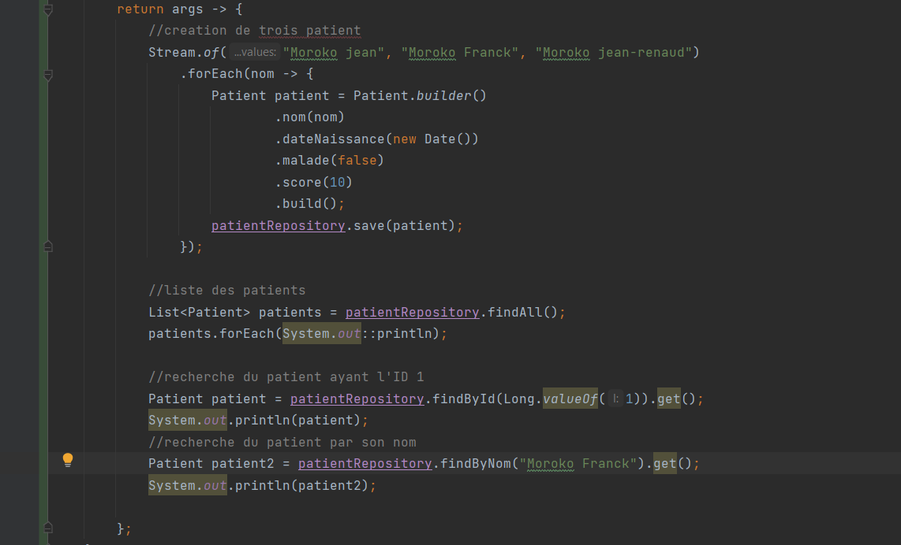

<h1>CRUD with Spring Data Jpa</h1>
1. Il faut avoir intellij utilimate installé
2. Création du projet spring avec les dépendances suivantes : JPA, H2, Spring Web et Lombok

3. Création de l'entité Patient

4. Configuration de l'unité de persistence

5. Création de l'interface Jpa repository

6. Tester quelques opérations de gestion de patients

6.1. Creation

6.2. Liste des patients

6.3. Consulter un patient

6.4. Rechercher des patients

6.5. Mettre à jour un patient

6.6. Supprimer un patient

7. Migration de H2 Database vers MySQL